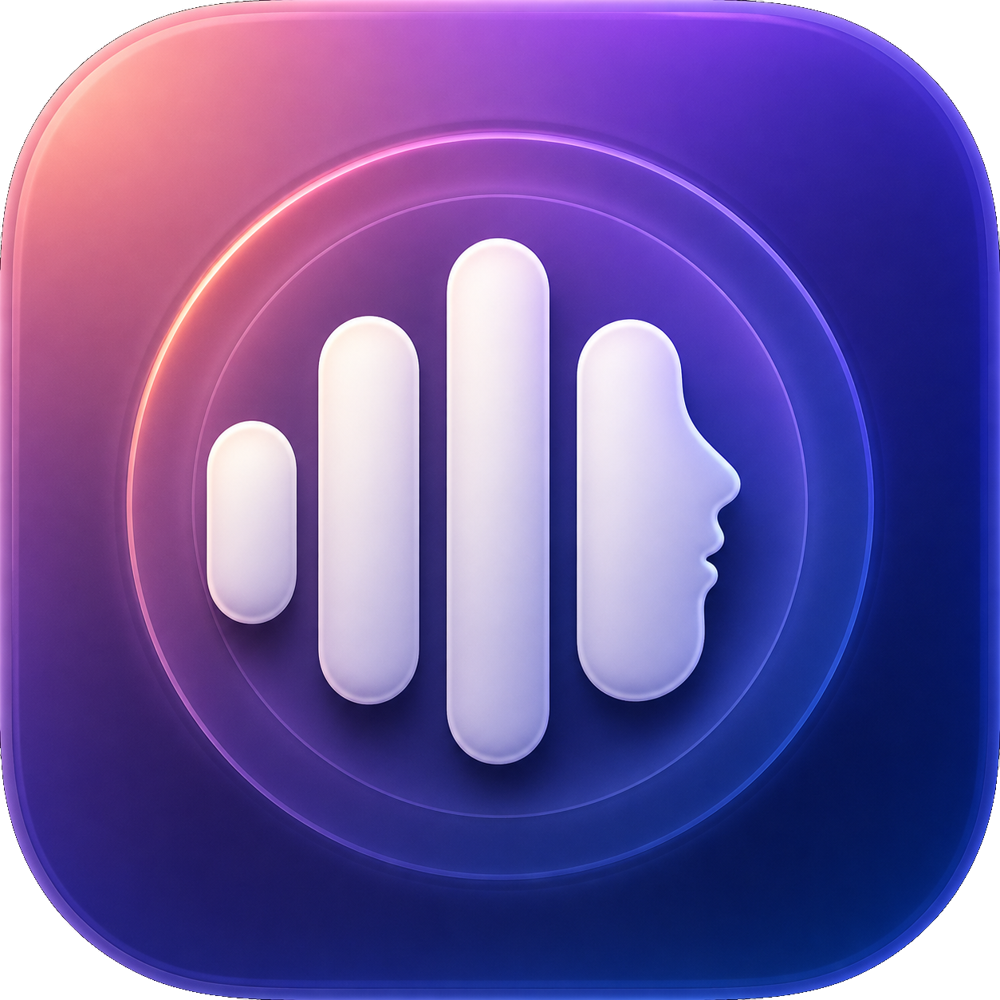

# VoixLocale



VoixLocale est une application macOS native qui transforme un texte en MP3 avec
une voix de référence. La synthèse et les profils vocaux restent sur le Mac.
L’icône originale combine une onde vocale et un profil humain.

## Fonctionnalités du MVP

- enregistrement d’un échantillon avec le microphone ;
- consentement explicite avant la création d’une voix ;
- import TXT, PDF et DOCX, ou saisie directe ;
- synthèse française avec Qwen3-TTS 1.7B BF16 et Apple MLX ;
- clonage par empreinte vocale, sans réinjection du texte d’échantillonnage ;
- découpage automatique des textes longs ;
- débit réglable (1,10× par défaut) et hésitations légères optionnelles ;
- réduction douce du bruit de fond et nettoyage des silences entre segments ;
- contrôles de lecture, pause, reprise et arrêt dans l’interface ;
- navigation par onglets illustrés avec pictogrammes au-dessus des libellés ;
- lecture et export MP3 VBR haute qualité ;
- stockage local dans `~/Library/Application Support/VoixLocale`.

## Construire l’application

Prérequis : macOS 14 ou ultérieur, Apple Silicon, Xcode.

Les binaires système requis sont déclarés dans `backend/system-requirements.txt`,
pendant système du `requirements.txt` Python. Pour les vérifier ou les installer :

```bash
./scripts/check_requirements.sh            # rapport
./scripts/check_requirements.sh --install  # installe ce qui manque via Homebrew
```

`backend/run_backend.sh` lance cette vérification au démarrage : si FFmpeg manque,
le backend s'arrête immédiatement avec un message explicite, au lieu d'échouer plus
tard sur une erreur 500 au moment d'enrôler une voix ou de générer un MP3.

```bash
./scripts/check_requirements.sh --install
./scripts/build_app.sh
open ./dist/VoixLocale.app
```

L’application résultante se trouve dans `dist/VoixLocale.app`. Au premier
lancement, le service local crée son environnement Python. Le modèle MLX est
téléchargé lors de la première génération ; les lancements suivants peuvent se
faire hors ligne.

Pour le développement :

```bash
./scripts/run_dev.sh
```

Ce script construit toujours le bundle `.app` avant de le lancer : `swift run`
produit un exécutable nu, sans `Info.plist`, et macOS tue alors le processus dès
qu'il demande l'accès au microphone.

### Autorisation microphone

L'application est signée avec le Hardened Runtime, ce qui rend l'entitlement
`com.apple.security.device.audio-input` (dans `scripts/VoixLocale.entitlements`)
obligatoire pour enregistrer une voix.

macOS met en cache sa décision d'autorisation par identifiant de bundle **et par
signature**. Après avoir resigné l'application, une autorisation refusée
auparavant reste appliquée ; pour repartir d'un état neuf :

```bash
tccutil reset Microphone fr.voixlocale.app
```

## Confidentialité

Le serveur écoute uniquement sur `127.0.0.1`. Les enregistrements et sorties ne
sont envoyés à aucun service distant. Le téléchargement initial des dépendances
et du modèle est la seule étape nécessitant Internet.

Ne clonez que votre propre voix ou une voix pour laquelle vous disposez d’une
autorisation explicite.

## État du projet

VoixLocale est actuellement distribué en version bêta. L’application est
gratuite et son code source est accessible publiquement. Aucune licence de
réutilisation n’est accordée tant qu’un fichier `LICENSE` n’a pas été ajouté au
dépôt.
